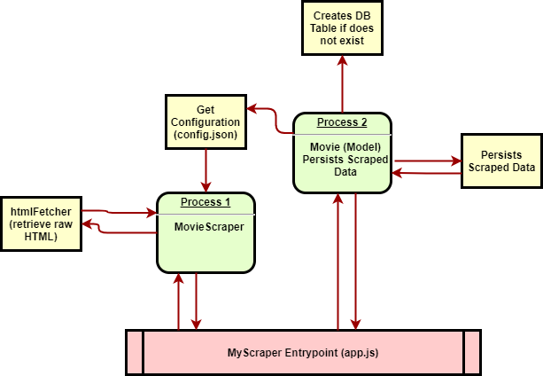
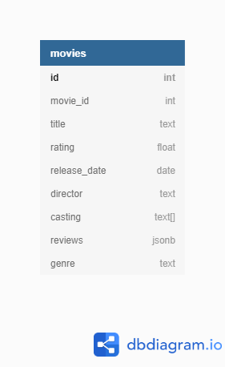

# MyScraper (SensCritique)

A simple test app that scraps a given movie page from SensCritique's website (https://www.senscritique.com).
By Default the scraper will try to scrap 'Fight Club' movie's page from SC.

This app uses NodeJS (no server) and PostgreSQL.

## Prerequisites
- Docker CE & docker-compose (preferred)
- PGAdmin (if you want to easily query the DB but not mandatory)

## Setup the application

Open a new terminal and follow the step below:

```bash
$>docker-compose build
db uses an image, skipping
Building app
Step 1/5 : FROM node:lts-alpine3.11
 ---> afd897e3184b
Step 2/5 : WORKDIR /opt
 ---> Using cache
 ---> b682a52021dc
Step 3/5 : ADD . .
 ---> 102b83b6e5fe
Step 4/5 : RUN npm install
 ---> Running in 655417b970a1
audited 1204486 packages in 6.661s

25 packages are looking for funding
  run `npm fund` for details

found 0 vulnerabilities

Removing intermediate container 655417b970a1
 ---> bd466bfad39e
Step 5/5 : CMD ["node", "/opt/src/app.js"]
 ---> Running in 551609ef0b01
Removing intermediate container 551609ef0b01
 ---> 1243fbe97c37
Successfully built 1243fbe97c37
Successfully tagged myscraper_app:latest
$>
```

## Start the application

Again using docker-compose, enter the command below:

```bash
$>docker-compose up
... some database blabla..
myscraper exited with code 0 <- That is good!
```

## Application architecture

Since the application only job is to scrap SensCritique's 'Fight Club' page, its implementation is pretty simple, anyway here is a diagram of how things work:



## Database Schema

A new record should have been persisted into the DB, you could use a graphical tool such as PGAdmin or directly pgsql command line interface from your shell in order to run queries.

There is only a table called 'movies' that is created when the scraper has finished its job.



### Database Access Credentials (Dev)

The port is by default set to 5432.

```
    - POSTGRES_PASSWORD=secretpassword
    - POSTGRES_USER=dbuser
    - POSTGRES_DB=dev
```

## Tests

The tests are run with [Jest](https://jestjs.io/) framework.

You can run test with the command below:

```bash
$>npm run test
```

There is also a linter powered by [Standard JS](https://standardjs.com/rules-en.html)

```bash
$>npm install -g standard
$>standard
```

## Logging

A custom logging system has been implemented using [Winston](https://github.com/winstonjs/winston) :).
